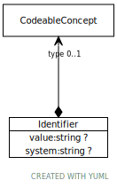

# Class: Identifier

URI: [types:Identifier](https://example.org/ccdh/datatypes/Identifier)

## Attributes

### Own

 * [➞system](identifier__system.md)  OPT
     * Description: The system or namespace that defines the identifier.
     * range: [String](types/String.md)
 * [➞type](identifier__type.md)  OPT
     * Description: A code that defines the type of the identifier.
     * range: [CodeableConcept](CodeableConcept.md)
 * [➞value](identifier__value.md)  OPT
     * Description: The value of the identifier, as defined by the system.
     * range: [String](types/String.md)
