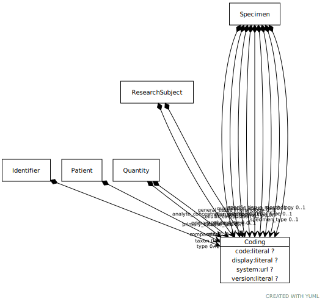

# Class: Coding

A structured representation of a coded/enumerated data value, that includes additional metadata about the code and code system.

URI: [ccdh:Coding](https://example.org/ccdh/Coding)

## Referenced by class

 *  **None** *[➞coding](codeableConcept__coding.md)*  0..*  **[Coding](Coding.md)**
 *  **None** *[➞comparator](quantity__comparator.md)*  OPT  **[Coding](Coding.md)**
 *  **None** *[➞unit](quantity__unit.md)*  OPT  **[Coding](Coding.md)**

## Attributes

### Own

 * [➞code](coding__code.md)  OPT
     * Description: The value of the code itself.
     * range: [String](types/String.md)
 * [➞display](coding__display.md)  OPT
     * Description: A human-readable name for the code.
     * range: [String](types/String.md)
 * [➞system](coding__system.md)  OPT
     * Description: The code system where the code is defined.
     * range: [String](types/String.md)
 * [➞version](coding__version.md)  OPT
     * Description: The version of the code system.
     * range: [String](types/String.md)
