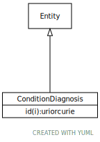

# Type: ConditionDiagnosis

URI: [ccdh:ConditionDiagnosis](https://ccdh.org/ConditionDiagnosis)

## Parents

 *  is_a: [Entity](Entity.md) - Any resource that has its own identifier

## Attributes

### Inherited from Entity:

 * [Entity➞id](Entity_id.md)  REQ
    * range: [Uriorcurie](types/Uriorcurie.md)

## Other properties

|  |  |  |
| --- | --- | --- |
| **Mappings:** | | FHIR:Condition |

