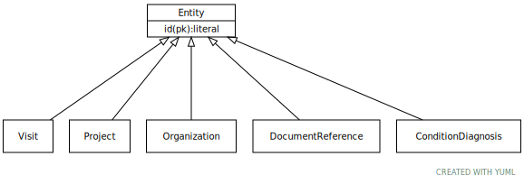

# Class: Entity

Any resource that has its own identifier

URI: [ccdh:Entity](https://example.org/ccdh/Entity)

## Children

 * [Patient](Patient.md)
 * [Project](Project.md)
 * [ResearchSubject](ResearchSubject.md) - A research subject is the entity of interest in a research study, typically a human being or an animal, but can also be a device, group of humans or animals, or a tissue sample. Human research subjects are usually not traceable to a particular person to protect the subject’s privacy.
 * [Specimen](Specimen.md) - Any material taken as a sample from a biological entity (living or dead), or from a physical object or the environment. Specimens are usually collected as an example of their kind, often for use in some investigation.

## Referenced by class

## Attributes

### Own

 * [id](id.md)  REQ
     * range: [String](types/String.md)
