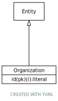

# Type: Organization

URI: [ccdh:Organization](https://ccdh.org/Organization)

## Parents

 *  is_a: [Entity](Entity.md) - Any resource that has its own identifier

## Referenced by class

## Attributes

### Own

 * [Organization➞id](Organization_id.md)  REQ
    * Description: Organization id
    * range: [Literal](types/Literal.md)

## Other properties

|  |  |  |
| --- | --- | --- |
| **Mappings:** | | FHIR:Organization |
|  | | BRIDG:Organization |

