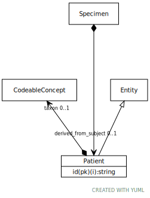

# Class: Patient

URI: [ccdh:Patient](https://example.org/ccdh/Patient)

## Parents

 *  is_a: [Entity](Entity.md) - Any resource that has its own identifier

## Referenced by class

 *  **None** *[➞associated_patient](researchSubject__associated_patient.md)*  OPT  **[Patient](Patient.md)**
 *  **None** *[➞derived_from_subject](specimen__derived_from_subject.md)*  OPT  **[Patient](Patient.md)**

## Attributes

### Own

 * [Patient➞id](Patient_id.md)  REQ
     * Description: The 'logical' identifier of the entity in the system of record, e.g. a UUID.  This 'id' is unique within a given system. The identified entity may have a different 'id' in a different system.
     * range: [String](types/String.md)
 * [➞identifier](patient__identifier.md)  0..*
     * Description: A 'business' identifier for the entity, typically as provided by an external system or authority, that persists across implementing systems. 
     * range: [Identifier](Identifier.md)
 * [➞taxon](patient__taxon.md)  OPT
     * Description: The taxonomic group (e.g. species) of the patient.
     * range: [CodeableConcept](CodeableConcept.md)
