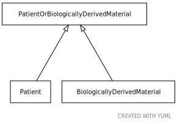

# Type: PatientOrBiologicallyDerivedMaterial

URI: [ccdh:PatientOrBiologicallyDerivedMaterial](https://ccdh.org/PatientOrBiologicallyDerivedMaterial)

## Children

 * [BiologicallyDerivedMaterial](BiologicallyDerivedMaterial.md)
 * [Patient](Patient.md)

## Referenced by class

## Attributes

