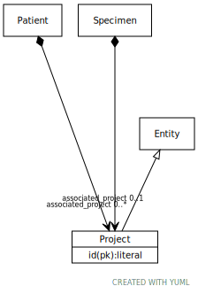

# Class: Project

URI: [ccdh:Project](https://example.org/ccdh/Project)

## Parents

 *  is_a: [Entity](Entity.md) - Any resource that has its own identifier

## Referenced by class

 *  **None** *[➞associated_project](researchSubject__associated_project.md)*  0..*  **[Project](Project.md)**
 *  **None** *[➞associated_project](specimen__associated_project.md)*  OPT  **[Project](Project.md)**

## Attributes

### Own

 * [Project➞id](Project_id.md)  REQ
     * range: [String](types/String.md)
