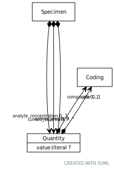

# Class: Quantity

A structured object to represent an amount of something (e.g., weight, mass, length, duration of time) - including a value and unit.

URI: [ccdh:Quantity](https://example.org/ccdh/Quantity)

## Referenced by class

 *  **None** *[➞analyte_concentration](specimen__analyte_concentration.md)*  OPT  **[Quantity](Quantity.md)**
 *  **None** *[➞current_volume](specimen__current_volume.md)*  0..*  **[Quantity](Quantity.md)**
 *  **None** *[➞current_weight](specimen__current_weight.md)*  0..*  **[Quantity](Quantity.md)**

## Attributes

### Own

 * [➞comparator](quantity__comparator.md)  OPT
     * Description: How to understand the value  . . .   < | <= | >= | >
     * range: [Coding](Coding.md)
 * [➞unit](quantity__unit.md)  OPT
     * Description: Unit representation (e.g. mg, mL)
     * range: [Coding](Coding.md)
 * [➞value](quantity__value.md)  OPT
     * Description: Numerical value (with implicit precision)
     * range: [Decimal](types/Decimal.md)
