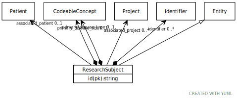

# Type: ResearchSubject

URI: [ccdh:ResearchSubject](https://example.org/ccdh/ResearchSubject)

## Parents

 *  is_a: [Entity](Entity.md) - Any resource that has its own identifier

## Referenced by class

## Attributes

### Own

 * [ResearchSubject➞id](ResearchSubject_id.md)  REQ
    * Description: The 'logical' identifier of the entity in the system of record, e.g. a UUID.  This 'id' is unique within a given system. The identified entity may have a different 'id' in a different system.
    * range: [Literal](types/Literal.md)
 * [➞identifier](researchSubject__identifier.md)  0..*
    * Description: A 'business' identifier for the entity, typically as provided by an external system or authority, that persists across implementing systems  (i.e. a  'logical' identifier). Uses a specialized, complex 'Identifier' data type to capture information about the source of the business identifier. 
    * range: [Identifier](Identifier.md)
 * [➞primary_disease_site](researchSubject__primary_disease_site.md)  OPT
    * Description: The text term used to describe the primary site of disease, as categorized by the World Health Organization's (WHO) International Classification of Diseases for Oncology (ICD-O). This categorization groups cases into general categories.
    * range: [Coding](Coding.md)
 * [➞primary_disease_type](researchSubject__primary_disease_type.md)  OPT
    * Description: The text term used to describe the type of malignant disease, as categorized by the World Health Organization's (WHO) International Classification of Diseases for Oncology (ICD-O). 
    * range: [Coding](Coding.md)
