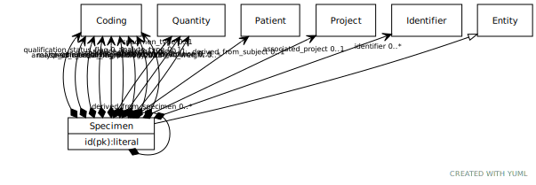

# Class: Specimen

Any material taken as a sample from a biological entity (living or dead), or from a physical object or the environment. Specimens are usually collected as an example of their kind, often for use in some investigation.

URI: [ccdh:Specimen](https://example.org/ccdh/Specimen)

## Parents

 *  is_a: [Entity](Entity.md) - Any resource that has its own identifier

## Referenced by class

 *  **None** *[➞derived_from_specimen](specimen__derived_from_specimen.md)*  0..*  **[Specimen](Specimen.md)**

## Attributes

### Own

 * [Specimen➞id](Specimen_id.md)  REQ
     * Description: The 'logical' identifier of the entity in the system of record, e.g. a UUID.  This 'id' is unique within a given system. The identified entity may have a different 'id' in a different system.
     * range: [String](types/String.md)
 * [➞analyte_concentration](specimen__analyte_concentration.md)  OPT
     * Description: The concentration of an extracted analyte that is present in a specimen (specifically, in a specimen of type 'analyte', or an 'aliquot' derived from an analyte). e.g. the concentration of DNA in a specimen created through extracting DNA from a blood sample.
     * range: [Quantity](Quantity.md)
 * [➞analyte_concentration_method](specimen__analyte_concentration_method.md)  OPT
     * Description: The method used to determine the concentration of purified analyte  within a solution.
     * range: [CodeableConcept](CodeableConcept.md)
 * [➞analyte_type](specimen__analyte_type.md)  OPT
     * Description: When the specimen is of type 'analyte' or 'aliquot', this is the type of substance the analyte represents (e.g. DNA, RNA)
     * range: [CodeableConcept](CodeableConcept.md)
 * [➞associated_project](specimen__associated_project.md)  OPT
     * Description: The Project associated with the specimen.
     * range: [Project](Project.md)
 * [➞cellular_composition](specimen__cellular_composition.md)  OPT
     * Description: The cellular composition of the sample
     * range: [CodeableConcept](CodeableConcept.md)
 * [➞current_volume](specimen__current_volume.md)  0..*
     * Description: The current total volume of the specimen, at the time of recording.
     * range: [Quantity](Quantity.md)
 * [➞current_weight](specimen__current_weight.md)  0..*
     * Description: The current weight of the specimen, at the time of recording (as opposed to an initial weight before its processing or portioning).
     * range: [Quantity](Quantity.md)
 * [➞derived_from_specimen](specimen__derived_from_specimen.md)  0..*
     * Description: A source/parent specimen from which this one was directly derived.
     * range: [Specimen](Specimen.md)
 * [➞derived_from_subject](specimen__derived_from_subject.md)  OPT
     * Description: The Patient/ResearchSubject, or Biologically Derived Materal (e.g. a cell line, tissue culture, organoid) from which the specimen was directly or indirectly derived.
     * range: [Patient](Patient.md)
 * [➞general_tissue_morphology](specimen__general_tissue_morphology.md)  OPT
     * Description: A term describing at a high-level the kind of tissue collected in a specimen, with respect to disease status or proximity to tumor tissue (e.g. is it normal, abnormal, tumor, tumor-adjacent). 

     * range: [CodeableConcept](CodeableConcept.md)
 * [➞identifier](specimen__identifier.md)  0..*
     * Description: A 'business' identifier  or accession number for the entity, typically as provided by an external system or authority, that persists across implementing systems  (i.e. a  'logical' identifier). 
     * range: [Identifier](Identifier.md)
 * [➞matched_normal_flag](specimen__matched_normal_flag.md)  0..*
     * Description: A flag indicating that there is no matched normal aliquot for this case that can be used for variant calling purposes.
     * range: [CodeableConcept](CodeableConcept.md)
 * [➞qualification_status_flag](specimen__qualification_status_flag.md)  OPT
     * Description: A flag indicating whether the specimen is qualified or disqualified for data analysis in a study.
     * range: [CodeableConcept](CodeableConcept.md)
 * [➞source_material_type](specimen__source_material_type.md)  OPT
     * Description: The general kind of material from which the specimen was derived, indicating the physical nature of the source material. 
     * range: [CodeableConcept](CodeableConcept.md)
 * [➞specific_tissue_morphology](specimen__specific_tissue_morphology.md)  OPT
     * Description: A term describing the specific pathology exhibited by the tissue in a specimen.
     * range: [CodeableConcept](CodeableConcept.md)
 * [➞specimen_type](specimen__specimen_type.md)  OPT
     * Description: The high-level type of the specimen, based on its how it has been derived from the original extracted sample. 

     * range: [CodeableConcept](CodeableConcept.md)
