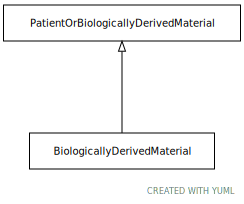

# Type: BiologicallyDerivedMaterial

URI: [specimen:BiologicallyDerivedMaterial](https://ccdh.org/specimen/BiologicallyDerivedMaterial)

## Parents

 *  is_a: [PatientOrBiologicalyDerivedMaterial](PatientOrBiologicalyDerivedMaterial.md)

## Attributes

