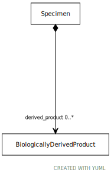

# Type: BiologicallyDerivedProduct

URI: [specimen:BiologicallyDerivedProduct](https://ccdh.org/specimen/BiologicallyDerivedProduct)

## Referenced by class

 *  **[Specimen](Specimen.md)** *[Specimen➞derived_product](Specimen_derived_product.md)*  0..*  **[BiologicallyDerivedProduct](BiologicallyDerivedProduct.md)**
 *  **None** *[derived_product](derived_product.md)*  0..*  **[BiologicallyDerivedProduct](BiologicallyDerivedProduct.md)**

## Attributes

