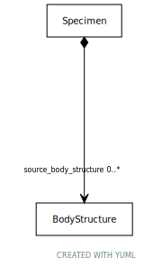

# Type: BodyStructure

URI: [specimen:BodyStructure](https://ccdh.org/specimen/BodyStructure)

## Referenced by class

 *  **[Specimen](Specimen.md)** *[Specimen➞source_body_structure](Specimen_source_body_structure.md)*  0..*  **[BodyStructure](BodyStructure.md)**
 *  **None** *[source_body_structure](source_body_structure.md)*  0..*  **[BodyStructure](BodyStructure.md)**

## Attributes

