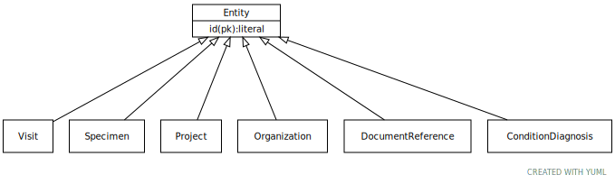

# Type: Entity

Any resource that has its own identifier

URI: [specimen:Entity](https://ccdh.org/specimen/Entity)

## Children

 * [ConditionDiagnosis](ConditionDiagnosis.md)
 * [DocumentReference](DocumentReference.md)
 * [Organization](Organization.md)
 * [Project](Project.md)
 * [Specimen](Specimen.md)
 * [Visit](Visit.md)

## Referenced by class

## Attributes

### Own

 * [id](id.md)  REQ
    * range: [Literal](types/Literal.md)
