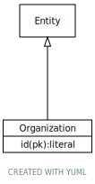

# Type: Organization

URI: [specimen:Organization](https://ccdh.org/specimen/Organization)

## Parents

 *  is_a: [Entity](Entity.md) - Any resource that has its own identifier

## Referenced by class

 *  **[Specimen](Specimen.md)** *[Specimen➞provided_by](Specimen_provided_by.md)*  OPT  **[Organization](Organization.md)**
 *  **None** *[provided_by](provided_by.md)*  OPT  **[Organization](Organization.md)**

## Attributes

### Inherited from Entity:

 * [id](id.md)  REQ
    * range: [Literal](types/Literal.md)

## Other properties

|  |  |  |
| --- | --- | --- |
| **Mappings:** | | FHIR:Organization |
|  | | BRIDG:Organization |

