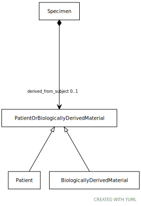

# Type: PatientOrBiologicallyDerivedMaterial

URI: [specimen:PatientOrBiologicallyDerivedMaterial](https://ccdh.org/specimen/PatientOrBiologicallyDerivedMaterial)

## Children

 * [BiologicallyDerivedMaterial](BiologicallyDerivedMaterial.md)
 * [Patient](Patient.md)

## Referenced by class

 *  **[Specimen](Specimen.md)** *[Specimen➞derived_from_subject](Specimen_derived_from_subject.md)*  OPT  **[PatientOrBiologicallyDerivedMaterial](PatientOrBiologicallyDerivedMaterial.md)**
 *  **None** *[derived_from_subject](derived_from_subject.md)*  OPT  **[PatientOrBiologicallyDerivedMaterial](PatientOrBiologicallyDerivedMaterial.md)**

## Attributes

