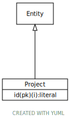

# Type: Project

URI: [specimen:Project](https://ccdh.org/specimen/Project)

## Parents

 *  is_a: [Entity](Entity.md) - Any resource that has its own identifier

## Referenced by class

 *  **[Specimen](Specimen.md)** *[Specimen➞associated_project](Specimen_associated_project.md)*  OPT  **[Project](Project.md)**
 *  **None** *[associated_project](associated_project.md)*  OPT  **[Project](Project.md)**

## Attributes

### Inherited from Entity:

 * [id](id.md)  REQ
    * range: [Literal](types/Literal.md)

## Other properties

|  |  |  |
| --- | --- | --- |
| **Mappings:** | | BRIDG:Project |

