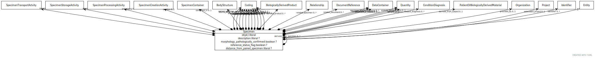

# Type: Specimen

URI: [specimen:Specimen](https://ccdh.org/specimen/Specimen)

## Parents

 *  is_a: [Entity](Entity.md) - Any resource that has its own identifier

## Referenced by class

## Attributes

### Own

 * [Specimen➞id](Specimen_id.md)  REQ
    * Description: The 'logical' identifier of the entity in the system of record, e.g. a UUID.  This 'id' is unique within a given system. The identified entity may have a different 'id' in a different system.
    * range: [Literal](types/Literal.md)
