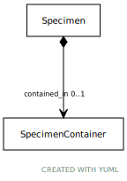

# Type: SpecimenContainer

URI: [specimen:SpecimenContainer](https://ccdh.org/specimen/SpecimenContainer)

## Referenced by class

 *  **[Specimen](Specimen.md)** *[Specimen➞contained_in](Specimen_contained_in.md)*  OPT  **[SpecimenContainer](SpecimenContainer.md)**
 *  **None** *[contained_in](contained_in.md)*  OPT  **[SpecimenContainer](SpecimenContainer.md)**

## Attributes

