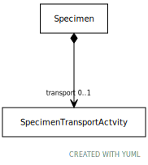

# Type: SpecimenTransportActvity

URI: [specimen:SpecimenTransportActvity](https://ccdh.org/specimen/SpecimenTransportActvity)

## Referenced by class

 *  **[Specimen](Specimen.md)** *[Specimen➞transport](Specimen_transport.md)*  OPT  **[SpecimenTransportActvity](SpecimenTransportActvity.md)**
 *  **None** *[transport](transport.md)*  OPT  **[SpecimenTransportActvity](SpecimenTransportActvity.md)**

## Attributes

